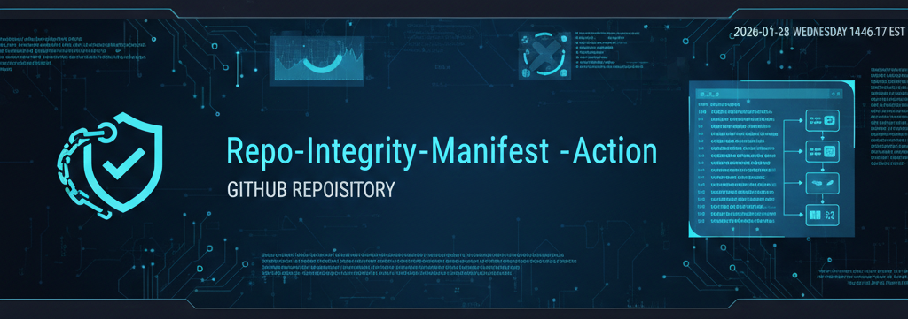

<p align="center">
  
</p>

<p align="center">

  <!-- Version Badge -->
  

  <!-- Workflow Status -->
  

  <!-- License -->
  

  <!-- Marketplace -->
  

</p>

# 📘 repo-integrity-manifest-action  
**A governance‑grade GitHub Action that generates deterministic integrity manifests for every file in your repository — in both JSON and Markdown formats — and commits them back automatically.**

This Action creates cryptographically verifiable snapshots of your repository’s structure and contents.  
It is designed for **governance**, **compliance**, **security engineering**, and **CI/CD integrity enforcement**.

Every run produces two artifacts inside `.governance/`:

- `repo-manifest.json` — machine‑readable, complete metadata  
- `repo-manifest.md` — human‑readable Markdown summary  

Together, they provide a **deterministic, audit‑ready view** of your repository at every commit.

---

# 🧭 Why This Action Exists

Modern repositories evolve constantly — files appear, disappear, mutate, and drift.  
Security teams, auditors, and engineering leaders need **deterministic, machine‑readable evidence** of what a repository contains at any point in time.

Traditional CI pipelines don’t provide:

- A full file inventory  
- Cryptographic hashing  
- Entropy analysis  
- Contributor metadata  
- Deterministic ordering  
- A persistent, committed ledger  

This Action fills that gap.

It creates a **self‑maintaining integrity manifest**, enabling:

- Governance workflows  
- Compliance reporting  
- Supply‑chain security  
- Drift detection  
- CI/CD enforcement  
- Repository forensics  

It turns your repository into a **verifiable, auditable asset**.

---

## 🛡️ Key Features

- 🔍 Full repository walk — every file, every commit  
- 🔐 SHA‑256 hashing for tamper detection  
- 🧠 Entropy scoring for anomaly detection  
- 📝 Contributor + commit metadata  
- 🗂️ Deterministic ordering for stable diffs  
- 🧾 JSON + Markdown manifest generation  
- 🤖 Automatically commits both manifests back to the repo  
- 🧩 Composite Action — no dependencies required  
- 🏗️ Ideal for governance, compliance, and CI enforcement  

---

## 🚀 How It Works

On every push or pull request:

1. The Action checks out your repository  
2. Runs the manifest generator (`generate-manifest.mjs`)  
3. Writes:
   - `.governance/repo-manifest.json`
   - `.governance/repo-manifest.md`
4. Commits updated manifests back to the repo (if changed)

This creates a **self‑maintaining integrity ledger** for your repository.

---

## 🔄 A Note on Git Pulls and Bot Commits

Because this Action commits updated manifests back to the repository on every run, you may occasionally see this behavior when pushing your own changes:

- Your push triggers the workflow  
- The workflow updates the manifests  
- The bot commits the updated files to `main`  
- Your local branch is now behind `origin/main`  

This is expected for governance workflows that auto‑commit artifacts.

If you see a message requiring you to fetch or pull before pushing, simply run:

\```bash
git pull --rebase
\```

or work in a feature branch and open a pull request.

---

## 📦 Usage

Add this workflow to your repo:

\```yaml
name: Repo Integrity Manifest

on:
  push:
  pull_request:

jobs:
  integrity:
    runs-on: ubuntu-latest
    permissions:
      contents: write

    steps:
      - name: Run Repo Integrity Manifest Action
        uses: scottmalin68-commits/repo-integrity-manifest-action@v1
\```

---

## 📁 Output: JSON Manifest

The Action generates:

\```
.governance/repo-manifest.json
\```

Example structure:

\```json
{
  "schema_version": "1.0.0-full",
  "generated_at": "2026-02-22T15:00:00Z",
  "repository": "git@github.com:owner/repo.git",
  "commit_sha": "abc123...",
  "files": [
    {
      "path": "src/index.js",
      "sha256": "…",
      "size_bytes": 1234,
      "mime_type": "application/javascript",
      "permissions": "644",
      "is_executable": false,
      "is_lfs_tracked": false,
      "entropy": 4.12,
      "ignore_status": "tracked",
      "contributor_count": 3,
      "last_commit": {
        "sha": "…",
        "author": "…",
        "email": "…",
        "timestamp": "…"
      }
    }
  ]
}
\```

---

## 📄 Output: Markdown Manifest

The Action also generates a human‑readable Markdown summary:

\```
.governance/repo-manifest.md
\```

This file provides a clean, auditor‑friendly table of repository contents.

Example excerpt:

\```markdown
# Repository Integrity Manifest (Markdown Version)

| Path | SHA‑256 | Size | MIME Type | Entropy | Contributors | Last Commit |
|------|---------|------|-----------|---------|--------------|-------------|
| src/index.js | abc123… | 1234 | application/javascript | 4.12 | 3 | 2026‑02‑22 |
\```

This format is ideal for:

- Governance reports  
- Security reviews  
- Documentation  
- Human‑readable audits  

---

## 🧩 Inputs & Outputs

This Action currently has **no inputs** and **no outputs**.  
It is intentionally deterministic and self‑contained.

Future versions may introduce:

- Optional artifact‑only mode  
- Optional diff reporting  
- Optional severity scoring  

---

# 🧠 Best Practices for Using This Action

To get the most value from this Action:

### **1. Use feature branches for development**  
Avoids frequent fetch/pull cycles caused by bot commits.

### **2. Use `git pull --rebase` instead of `git pull`**  
Keeps your commit history clean and linear.

### **3. Treat the manifests as governance artifacts**  
Do not manually edit `.governance/repo-manifest.json` or `.governance/repo-manifest.md`.

### **4. Run the Action on both `push` and `pull_request`**  
Ensures integrity checks occur before merging.

### **5. Tag stable releases (`v1`, `v1.0.0`)**  
Allows other repositories to depend on your Action reliably.

---

## 🛠️ Development

This Action is built using:

- A Node.js manifest generator (`generate-manifest.mjs`)  
- A composite GitHub Action (`action.yml`)  
- A schema definition (`schema.json`)  

To run locally:

\```bash
node generate-manifest.mjs
\```

---

## 🏷️ Versioning

Once ready for release:

1. Create a tag: `v1.0.0`  
2. Create a moving major tag: `v1`  
3. Publish to the GitHub Marketplace  

---

## 📄 License

MIT License — see `LICENSE` for details.
